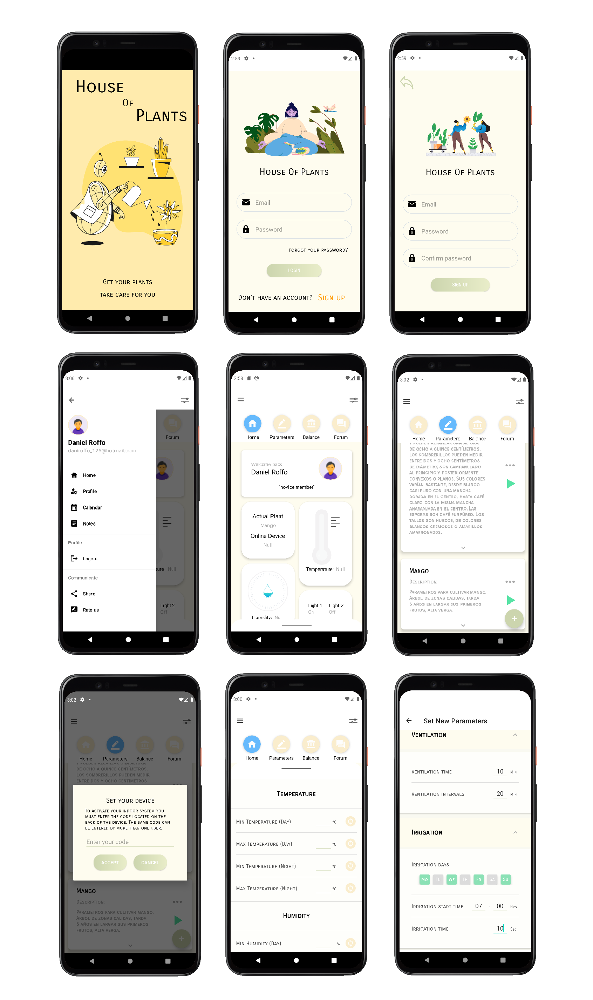

# Indoor Automatizado 
Proyecto personal creado con el propósito de aprender más a fondo sobre desarrollo Android con Kotlin y Arduino, trabajando en conjunto con un amigo especializado en Arduino.

Por el momento su desarrollo se encuentra pausado y probablemente a futuro limpie y reorganice el código. Hay mucho para borrar y optimizar, ya que arranque el proyecto con el fin de aprender y divertirme incorporando nuevos conceptos.

La idea es retomarlo o rearmarlo de cero después de realizar los trabajos que me encuentro haciendo en TECSI, en donde me encuentro haciendo proyectos similares, pero aplicando mejores prácticas y arquitecturas limpias.

Dejo unas fotos del progreso hasta ahora

